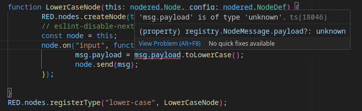
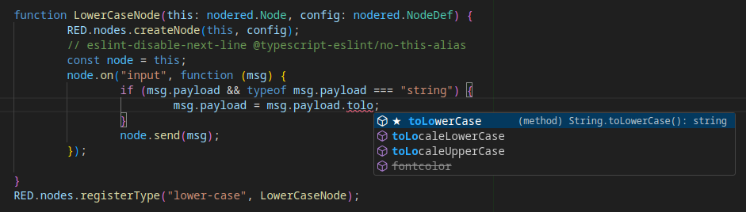

<!-- Improved compatibility of back to top link: See: https://github.com/othneildrew/Best-README-Template/pull/73 -->

<!-- PROJECT SHIELDS -->
<!--
*** I'm using markdown "reference style" links for readability.
*** Reference links are enclosed in brackets [ ] instead of parentheses ( ).
*** See the bottom of this document for the declaration of the reference variables
*** for contributors-url, forks-url, etc. This is an optional, concise syntax you may use.
*** https://www.markdownguide.org/basic-syntax/#reference-style-links
-->
[![Contributors][contributors-shield]][contributors-url]
[![Forks][forks-shield]][forks-url]
[![Stargazers][stars-shield]][stars-url]
[![Issues][issues-shield]][issues-url]
[![Apache 2.0 License][license-shield]][license-url]

<!-- PROJECT LOGO -->
 

  

<h3 align="center">Node-red lowercase node in TypeScript</h3>

<!-- TABLE OF CONTENTS -->

  
Table of Contents

  <ol>
    <li>
      <a href="#about-the-project">About The Project</a>
      <ul>
        <li><a href="#built-with">Built With</a></li>
      </ul>
    </li>
    <li>
      <a href="#getting-started">Getting Started</a>
      <ul>
        <li><a href="#prerequisites">Prerequisites</a></li>
        <li><a href="#installation">Installation</a></li>
      </ul>
    </li>
    <li><a href="#usage">Usage</a></li>
    <li><a href="#roadmap">Roadmap</a></li>
    <li><a href="#contributing">Contributing</a></li>
    <li><a href="#license">License</a></li>
    <li><a href="#contact">Contact</a></li>
    <li><a href="#acknowledgments">Acknowledgments</a></li>
  </ol>

## About The Project

This is the classical `lower-case` example from the
[node-red documentation](https://nodered.org/docs/creating-nodes/first-node#creating-a-simple-node) **but converted from Javascript to
[TypeScript](https://stackoverflow.com/tags/typescript/info)**.

But why Typescript? Many, many reasons, for instance did you know that the
original code contains a bug in that it assumes unconditionally that `msg`
contains a `payload` member and that it is always a string? By using Typescript
the compiler and IDE are able to pick up that and give you an error:

    

and by fixing that not only does the compiler stop complaining "Hey, the type of
payload is unknown, you cannot assume it exists or that it is a string", but now
it also are able to safely provide suggestions on which methods a string
variable has and you might be interested in using:

    

So while having a lower-case capable node is perhaps by it self not that super
exciting, the idea is that you should be able to use this project as a
template/starting point to develop your awesome Node-RED node, *in Typescript*.

(<a href="#readme-top">back to top</a>)

### Built With

* [![NODE-red][nodered-img]][nodered-url]
* [![TypeScript][TypeScript-img]][TypeScript-url]
* [![Node.js][nodejs-img]][nodejs-url]
* [![NPM][npm-img]][npm-url]
* [![Git][git-img]][git-url]

(<a href="#readme-top">back to top</a>)

## Usage

1. Fork this repository.
2. Make whatever modifications you want.
3. Run tests.
4. Profit?

(<a href="#readme-top">back to top</a>)

## Roadmap

* [ ] Wait for pull request to [support ESM to be merged](https://github.com/node-red/node-red/pull/4355)
  and then update to ESM.
* [ ] Publish on NPM (pending esm support).

See the [open issues](https://github.com/hlovdal/hlovdal-node-red-lowercase-in-typescript/issues) for a full list of proposed features (and known issues).

(<a href="#readme-top">back to top</a>)

## Contributing

Contributions are what make the open source community such an amazing place to learn, inspire, and create. Any contributions you make are **greatly appreciated**.

If you have a suggestion that would make this better, please fork the repo and create a pull request. You can also simply open an issue with the tag "enhancement".
Don't forget to give the project a star! Thanks again!

1. Fork the Project
2. Create your Feature Branch (`git checkout -b feature/AmazingFeature`)
3. Commit your Changes (`git commit -m 'Add some AmazingFeature'`)
4. Push to the Branch (`git push origin feature/AmazingFeature`)
5. Open a Pull Request

(<a href="#readme-top">back to top</a>)

## License

While the documentation page does not explicitly say, the
[repository says Apache 2.0](https://github.com/node-red/node-red.github.io/blob/master/LICENSE). But that covers the lowercase code. When you remove that code to
replace it with your own code feel free to change the license of your new
project to something else, including LGPL.

(<a href="#readme-top">back to top</a>)

## Contact

  

    <a href="https://github.com/hlovdal/hlovdal-node-red-lowercase-in-typescript/issues">Report Bug</a>
    ·
    <a href="https://github.com/hlovdal/hlovdal-node-red-lowercase-in-typescript/issues">Request Feature</a>
  

Project Link: [https://github.com/hlovdal/hlovdal-node-red-lowercase-in-typescript](https://github.com/hlovdal/hlovdal-node-red-lowercase-in-typescript)

<!--

(<a href="#readme-top">back to top</a>)

## Acknowledgments

* 
* 
* 
-->

(<a href="#readme-top">back to top</a>)

<!-- MARKDOWN LINKS & IMAGES -->
<!-- https://www.markdownguide.org/basic-syntax/#reference-style-links -->
[contributors-shield]: https://img.shields.io/github/contributors/hlovdal/hlovdal-node-red-lowercase-in-typescript.svg?style=for-the-badge
[contributors-url]: https://github.com/hlovdal/hlovdal-node-red-lowercase-in-typescript/graphs/contributors

[forks-shield]: https://img.shields.io/github/forks/hlovdal/hlovdal-node-red-lowercase-in-typescript.svg?style=for-the-badge
[forks-url]: https://github.com/hlovdal/hlovdal-node-red-lowercase-in-typescript/network/members

[stars-shield]: https://img.shields.io/github/stars/hlovdal/hlovdal-node-red-lowercase-in-typescript.svg?style=for-the-badge
[stars-url]: https://github.com/hlovdal/hlovdal-node-red-lowercase-in-typescript/stargazers

[issues-shield]: https://img.shields.io/github/issues/hlovdal/hlovdal-node-red-lowercase-in-typescript.svg?style=for-the-badge
[issues-url]: https://github.com/hlovdal/hlovdal-node-red-lowercase-in-typescript/issues

[license-shield]: https://img.shields.io/github/license/hlovdal/hlovdal-node-red-lowercase-in-typescript.svg?style=for-the-badge
[license-url]: https://github.com/hlovdal/hlovdal-node-red-lowercase-in-typescript/blob/master/LICENSE.txt

[git-img]: https://img.shields.io/badge/Git-F05032?style=for-the-badge&logo=git&logoColor=white
[git-url]: https://www.git-scm.com/

[npm-img]: https://img.shields.io/badge/NPM-CB3837?style=for-the-badge&logo=npm&logoColor=white
[npm-url]: https://svelte.dev/

[nodejs-img]: https://img.shields.io/badge/Node.js-339933?style=for-the-badge&logo=nodedotjs&logoColor=white
[nodejs-url]: https://laravel.com

[nodered-img]: https://img.shields.io/badge/nodered-8F0000?style=for-the-badge&logo=nodered
[nodered-url]: https://nodered.org/

[TypeScript-img]: https://img.shields.io/badge/TypeScript-3178C6?style=for-the-badge&logo=typescript&logoColor=white
[TypeScript-url]: https://www.typescriptlang.org/

<!-- https://simpleicons.org/?q=typescript -->
